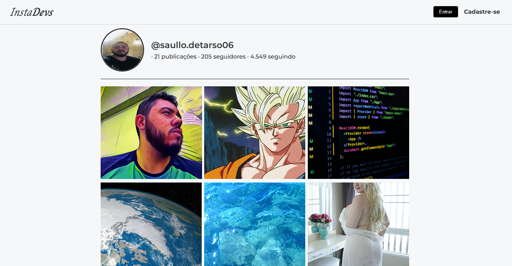

# Imersão Alura Back-End - Gemini 2024 - InstaBytes.

Uma API Restful, com rotas, requisições e respostas HTTP manuais, que servissa dados para um portfólio fictício chamado InstaBytes, simulando publicações e imagens (como se fosse o instagram).

<div align="center">
  
</div>

**IMPORTANTE:** É necessário ter o [Node.js](https://nodejs.org/) instalado em seu computador antes de executar os comandos de instalação e execução do projeto. Versão recomendada: v20.x.x.

## Clonando o repositório para o seu perfil no GitHub

Faça o **clone** do repositório para seu computador:
  - Clique no botão **<> Code** e copie o endereço HTTP remoto do repositório;
  - Abra o terminal, navegue até a pasta raiz onde deseja baixar o projeto e execute o comando `git clone <endereço HTTP remoto>`;
  - Você pode acessar a pasta do projeto direto pelo Visual Studio Code, clicando em File > Open Folder e selecionando a pasta do projeto.

## Instale as requisições do projeto pelo VScode:

1. Abra a pasta do projeto no Visual Studio Code clicando em File > Open Folder e selecionando a pasta do projeto;

2. Clique em Terminal > New Terminal no menu superior do Visual Studio Code. O terminal deve abrir já direcionando para a pasta correta do projeto;

3. Execute o comando `npm install` e aguarde a finalização.

## Execute o projeto para subir o servidor local:

Acesse o terminal (do Visual Studio Code ou outro), certifique-se que esteja exibindo a pasta correta do projeto e execute o comando **`npm run dev`**. 

O terminal deverá retornar a saída abaixo:

```
> instabytes-portfolio@1.0.0 dev   
> npx parcel --port 8000 index.html

Server running at http://localhost:8000
```
O projeto estará disponível no endereço http://localhost:8000 e você poderá acessá-lo no navegador conforme as configurações da máquina.
